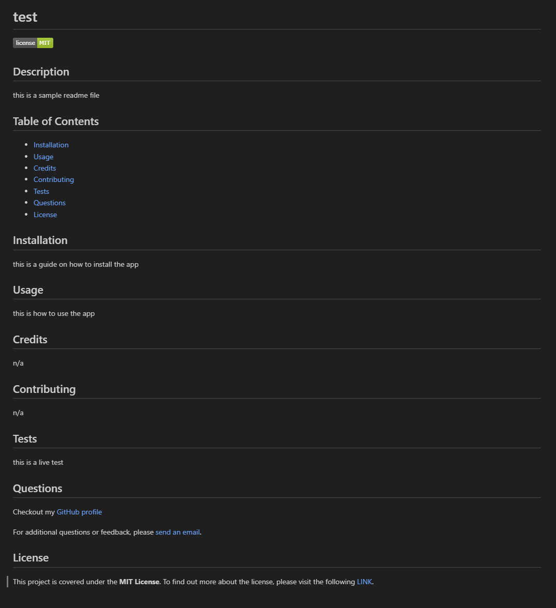

# README Generator

## Description

This is a command-line application which generates a README.md file based on a user's input.

## Installation

1. Download or clone this repository
2. [node.js](https://nodejs.org/en) is required for this application.
3. `npm i` in the terminal to install the required npm packages.

## Usage

1. The application will be invoked by using the following command: `node index.js`

2. User is prompted with questions regarding the README file.

3. When questions are answered, a README file is generated with the provided title and corresponding sections.

This is a sample README file, generated using this application.

To see how this application works, follow the [Walkthrough Video](https://drive.google.com/file/d/1gRO3plnv96q77C0wSZkx0K0BfC-umLKq/view?usp=sharing).

## Credits

Special thanks to [Xandromus](https://github.com/Xandromus) and [gachoi06](https://github.com/gachoi06) for providing the [starter code](https://github.com/coding-boot-camp/potential-enigma).

## License

Please refer to the LICENSE in the repo.

---
